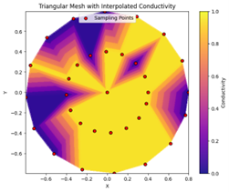

# EIT-reconstruction-using-deep-learning

## 📖 Overview

Electrical Impedance Tomography (EIT) is a non-invasive imaging technique that estimates the conductivity distribution inside an object using surface electrical measurements. This project uses deep learning to reconstruct the conductivity distribution of 2D and 3D EIT-based skins and perform touch localisation. 

We use EIDORS to construct Finite Element models of two-dimensional, and three-dimensional skins. 
Using touch stimulation, of single touch-points and multiple touch-points, we collect large datasets of EIT voltage signals, used for training and testing neural networks.
The datasets can be found at this link: https://liveuclac-my.sharepoint.com/:f:/g/personal/zcabndc_ucl_ac_uk/EnQzBS52gPpHozL1M2NmeAUBHbr1FOeGCwIrm9vk80lXTA
Or script files for stimulation can be found in this repo, in the folder simulation/. The script files enable construction of the skins with different number of electrodes, and stimulate touch of varying touch/grid resolutions.

Our design considers two main deep neural networks:
- A deep neural network, comprising of four layers.
- A one-dimensional convolutional neural network
Source code for these models are found in the folder, src/eit_reconstruction_models.py.

## 📊 Results

### Multi-label classification results for touch localisation

| Skin Geometry              | Sample Points | Best Network | MSE    | MAE    | RMSE   | Training Time (s) |
|---------------------------|----------------|--------------|--------|--------|--------|--------------------|
| 2D Skin with 8 Electrodes | 26             | 1D-CNN       | 0.016  | 0.090  | 0.126  | 420                |
| 2D Skin with 16 Electrodes| 32             | 1D-CNN       | 0.007  | 0.045  | 0.088  | 1260               |
| 2D Skin with 24 Electrodes| 32             | 1D-CNN       | 0.010  | 0.044  | 0.099  | 2710               |
|                           | 63             | DNN          | 0.006  | 0.023  | 0.076  | 1020               |
|                           | 160            | DNN          | 0.003  | 0.030  | 0.056  | 1300               |
|                           | 252            | 1D-CNN       | 0.002  | 0.024  | 0.038  | 1420               |
| 3D Skin with 8 Electrodes | 91             | DNN          | 0.016  | 0.101  | 0.127  | 850                |
| 3D Skin with 16 Electrodes| 91             | DNN          | 0.019  | 0.106  | 0.137  | 1040               |
|                           | 342            | DNN          | 0.005  | 0.060  | 0.072  | 1700               |

### Regression results for force predictions

| Skin Geometry              | Sample Points | Best Network | MSE    | MAE    | RMSE   | Training Time (s) |
|---------------------------|----------------|--------------|--------|--------|--------|--------------------|
| 2D Skin with 8 Electrodes | 26             | 1D-CNN       | 0.016  | 0.090  | 0.126  | 420                |
| 2D Skin with 16 Electrodes| 32             | 1D-CNN       | 0.007  | 0.045  | 0.088  | 1260               |
| 2D Skin with 24 Electrodes| 32             | 1D-CNN       | 0.010  | 0.044  | 0.099  | 2710               |
|                           | 63             | DNN          | 0.006  | 0.023  | 0.076  | 1020               |
|                           | 160            | DNN          | 0.003  | 0.030  | 0.056  | 1300               |
|                           | 252            | 1D-CNN       | 0.002  | 0.024  | 0.038  | 1420               |
| 3D Skin with 8 Electrodes | 91             | DNN          | 0.016  | 0.101  | 0.127  | 850                |
| 3D Skin with 16 Electrodes| 91             | DNN          | 0.019  | 0.106  | 0.137  | 1040               |
|                           | 342            | DNN          | 0.005  | 0.060  | 0.072  | 1700               |

### Image Reconstruction for two-dimensional skin

  <strong>Predicted</strong> &nbsp;&nbsp;&nbsp;&nbsp;&nbsp;&nbsp;&nbsp;&nbsp;&nbsp;&nbsp;
  <strong>Ground Truth</strong>

  
   
  
  

### Image Reconstruction for three-dimensional skin

  <strong>Predicted</strong> &nbsp;&nbsp;&nbsp;&nbsp;&nbsp;&nbsp;&nbsp;&nbsp;&nbsp;&nbsp;
  <strong>Ground Truth</strong>

  
   
  
  

## Future Work
Consider using an ensemble method of the 1D-CNN and DNN to improve quality of reconstructed images, and accuracy and precision of force predictions.
